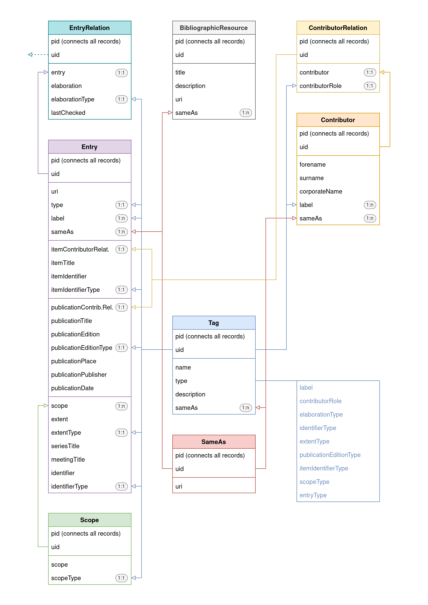

# DA Bib

- Description: Provide bibliographies for research data in TYPO3
- Author: Jonatan Jalle Steller ([jonatan.steller@adwmainz.de](mailto:jonatan.steller@adwmainz.de))
- Requirements: TYPO3 12
- License: GPL 3
- Version: 0.0.2

The extension provides a data model for bibliographic data. It is modelled after the [`biblStruct` element in TEI XML](https://www.tei-c.org/release/doc/tei-p5-doc/en/html/ref-biblStruct.html) as [produced by Zotero](https://github.com/zotero/translators/blob/master/TEI.js). The data can be listed as a bibliography, entries and contributors can be grouped via labels, and other data models can reference and elaborate on individual entries using the `EntryRelation` class. A flexible `SameAs` class adds options to identify, for example, authors via their OrcIDs in linked-data scenarios. A frontend plugin provides options to display selections of the bibliography, and a few common serialisations of bibliographic data are included out of the box. A TYPO3 task can be activated to periodically and automatically import data from a Zotero library.

## Setup

1. Install the extesion.
2. Add a `BibliographicResource` to a data folder that will hold all bibliographic data connected to this bibliography.
3. Optionally set up a task to periodically ingest Zotero data.

If you need to set up multiple bibliographies, simply set up multiple data folders and add a `BibliographicResource` to each of them.

## Usage

TBD

## Development

TBD

## Data model

All records of a single `BibliographicResource` are held together by using the same page ID (PID). The core class `Entry` has a set of fields that contain info on non-independent items (e.g. papers in a journal) as well as independent publications (e.g. the journal itself). Entries can be connected to other data models via `EntryRelation`, which may specify elaborations such as the specific page number of a citation. Since `Scope`s may be used several times in a bibliographic entry (e.g. page numbers of a paper and volume plus number of the journal it is published in), they can be repeated as their own class. The same goes for `Contributors`, which are connected to entries via a `ContributorRelation` that specifies their role (e.g. authors or editors). In addition, the model knows flexible `Tag`s and `SameAs` classes, which can be used to group entries and contributors via labels and to connect entities to Linked Open Data.

## Roadmap

- Basic implementation
- Optimise TCA for manual input
- Test and enhance the Extbase model and use in Fluid
- Add the frontend plugin
- Add generic serialisations such as TEI, BibTEX and JSON
- Implement the Zotero import
- Finish documentation

Known issues:

- Implement standard tags, maybe using a wizard or in the process of adding a `BibliographicResource`?
- Figure out the relevance of `EntryRelation`s using the same PID as the bibliography they are connected to.
